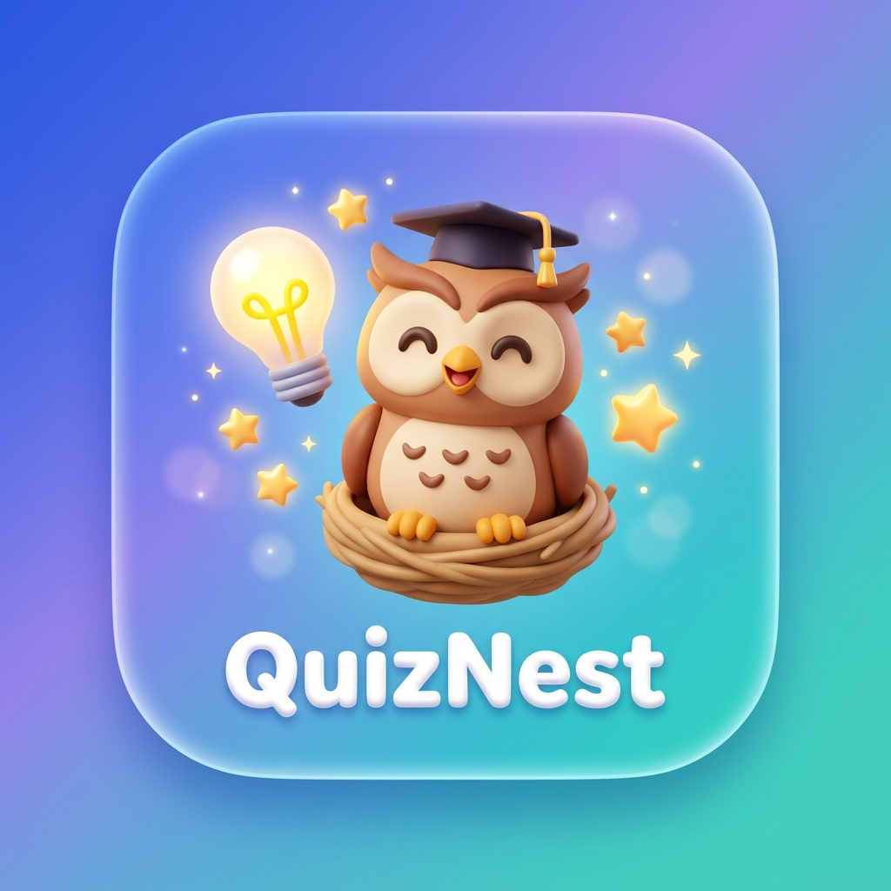

<div align="center">

  

  # QuizNest (Trivia)
  ### *Learn • Think • Play*

  A calm, modern, and offline-first educational trivia application designed for young learners aged 5–13.

  [](https://flutter.dev)
  [](https://dart.dev)
  [-003B57?logo=sqlite&logoColor=white)](https://drift.simonbinder.eu/)
  [](https://riverpod.dev)
  [](LICENSE)
  [](#)
  [](#)

</div>

---

## 📖 Overview

**QuizNest** is an educational mobile trivia platform that pairs calm, distraction-free design with rich offline capabilities. Built from the ground up for kids, parents, and curious minds, QuizNest works seamlessly without an internet connection while silently refreshing solved questions whenever network connectivity becomes available.

QuizNest eliminates ad trackers, behavioral profiling, and paywalls, delivering an accessible learning space across multiple subjects and languages.

---

## ✨ Key Features

### 🧠 10 Curated Learning Subjects
Explore a diverse collection of topics across STEM, humanities, and regional languages:
- 🧪 **Science** — Nature, biology, chemistry, and planetary facts.
- 📐 **Math** — Arithmetic, logic puzzles, sequences, and geometry.
- 📖 **English** — Vocabulary, grammar, spelling, and sentence structures.
- 🌍 **General Knowledge** — Global facts, world wonders, and inventors.
- 🏛️ **History** — Ancient civilizations, landmarks, and milestones.
- 🗺️ **Geography** — Continents, oceans, capitals, and topography.
- 💻 **Computers** — Hardware, software concepts, and digital safety.
- 🐾 **Animals** — Wildlife habitats, marine life, and animal behaviors.
- 🇮🇳 **Telugu (తెలుగు)** — తెలుగు భాష, అక్షరాలు, పదాలు, సాహిత్యం.
- 🇮🇳 **Hindi (हिन्दी)** — भाषा, वर्णमाला, व्याकरण, और रोचक ज्ञान।

### ⚡ 100% Offline-First Architecture
- **Bundled Question Bank**: Preloaded with over **1,000+ curated questions** stored locally in high-performance **Drift (SQLite)**.
- **Instant Play Anywhere**: Works in classrooms, on flights, or during road trips without requiring Wi-Fi or cellular data.

### 🔄 Dynamic Auto-Replenishment (Zero Manual Effort)
- Whenever internet access is available, QuizNest automatically replenishes solved questions in the background using the **Open Trivia Database (OpenTDB)**.
- Solved questions are retired so learners consistently encounter fresh challenges.
- Option shuffling guarantees that correct choices never repeat in predictable positions.

### 🎯 Adaptive Learning Stages
Content difficulty dynamically scales across three tailored tiers:
- **5–7 Years (Beginner)**: Gentle vocabulary, early logic, and visual question formats.
- **8–10 Years (Explorer)**: Elementary science, animal facts, and curiosity-building trivia.
- **11–13 Years (Challenger)**: Critical thinking, advanced history, geography, and deep logic puzzles.

### 🛡️ Child Safety & Privacy Protection
- **Zero Tracking**: No user telemetry, analytics, personal IDs, or cookies are ever gathered or uploaded.
- **Permission-Free**: No camera, microphone, contacts, location, or sensitive OS permissions required.
- **One-Time Safety Disclosure**: Explicit parent-friendly safety agreement presented upon first launch.

### 🏆 Gamified Mastery & 2026 UI Design
- **10/10 Perfect Score Celebration**: Particle-based confetti burst and trophy animation for flawless quiz sessions.
- **Floating Pill Navigation**: Ergonomic bottom navigation bar tailored for one-handed and tablet interactions.
- **Adaptive Aesthetics**: Squircle companion avatars, glassmorphic cards, and high-contrast typography.

---

## 🛠️ Technology Stack

| Layer | Technology |
| :--- | :--- |
| **Framework** | [Flutter](https://flutter.dev) (iOS, Android, Web, Desktop) |
| **Language** | [Dart](https://dart.dev) (Null-safe) |
| **State Management** | [Flutter Riverpod](https://riverpod.dev) |
| **Persistence & DB** | [Drift](https://drift.simonbinder.eu/) (Type-safe SQLite abstraction) |
| **Background Sync** | [WorkManager](https://pub.dev/packages/workmanager) |
| **Preferences** | [SharedPreferences](https://pub.dev/packages/shared_preferences) |
| **Typography** | [Google Fonts](https://pub.dev/packages/google_fonts) (Outfit / Plus Jakarta Sans) |
| **Remote Content** | [Open Trivia Database API](https://opentdb.com/) |

---

## 📂 Project Structure

```text
lib/
├── background/                     # Android WorkManager background sync workers
├── core/
│   ├── constants/                  # Color tokens, constants, subject catalogs
│   ├── theme/                      # Material 3 light theme definition
│   └── utils/                      # Checksum, JSON validation, HTML unescaping
├── data/
│   ├── database/                   # Drift SQLite schema, DAOs, migrations
│   ├── datasources/                # Local asset packs & OpenTDB remote datasources
│   ├── models/                     # Data transfer objects & JSON converters
│   └── repositories/               # Repository implementations (Sync, Question, User)
├── domain/
│   ├── entities/                   # Pure business entities (Question, Subject, Quiz)
│   └── repositories/               # Domain repository interfaces
├── presentation/
│   ├── common/                     # Reusable widgets (AppButton, PillNavBar, Confetti)
│   ├── home/                       # Dashboard, greeting header, subject grid
│   ├── onboarding/                 # Splash, Welcome, Name entry, Age stage selection
│   ├── progress/                   # Progress analytics, stars, subject mastery
│   ├── providers/                  # Riverpod state providers (Quiz, Sync, UserProfile)
│   ├── quiz/                       # Active quiz engine, countdown, option selectors
│   ├── result/                     # Result summary, stars, 10/10 celebration
│   └── settings/                   # Audio toggles, auto-sync badge, developer portfolio
└── main.dart                       # App entry point, startup initialization gate
```

---

## 🚀 Getting Started

### Prerequisites
- [Flutter SDK](https://docs.flutter.dev/get-started/install) (`v3.24.0` or higher)
- [Dart SDK](https://dart.dev/get-dart) (`v3.5.0` or higher)
- Android Studio / VS Code with Flutter extension
- Java JDK 17 (for Android compilation)

### Installation & Setup

1. **Clone the repository:**
   ```bash
   git clone https://github.com/akhilbehara999/QuizNest.git
   cd QuizNest
   ```

2. **Install dependencies:**
   ```bash
   flutter pub get
   ```

3. **Run database code generation (if modifying tables):**
   ```bash
   dart run build_runner build --delete-conflicting-outputs
   ```

4. **Launch the application:**
   ```bash
   # Run on connected mobile device or emulator
   flutter run

   # Or run on Chrome
   flutter run -d chrome
   ```

---

## 🧪 Testing

QuizNest includes an extensive test suite covering SQLite database queries, OpenTDB parsing, question filtering, shuffle stability, and widget UI interactions.

Run all tests:
```bash
flutter test
```

---

## 📦 Building Production APKs

Build architecture-optimized release APKs (split per ABI):
```bash
flutter build apk --split-per-abi
```

Generated binaries will be available in `build/app/outputs/flutter-apk/`:
- `app-arm64-v8a-release.apk` (Optimized for modern Android devices)
- `app-armeabi-v7a-release.apk` (Optimized for legacy 32-bit Android devices)
- `app-x86_64-release.apk` (Optimized for emulators & Chromebooks)

---

## 👨‍💻 Developer & Creator

<div align="center">

  ### **Akhil**
  *Lead Developer & Creator*

  [](https://akhil-portfolio-rho.vercel.app/)

  Personal Portfolio: **[https://akhil-portfolio-rho.vercel.app/](https://akhil-portfolio-rho.vercel.app/)**

</div>

---

## 📄 License

This project is licensed under the MIT License — see the [LICENSE](LICENSE) file for details.
